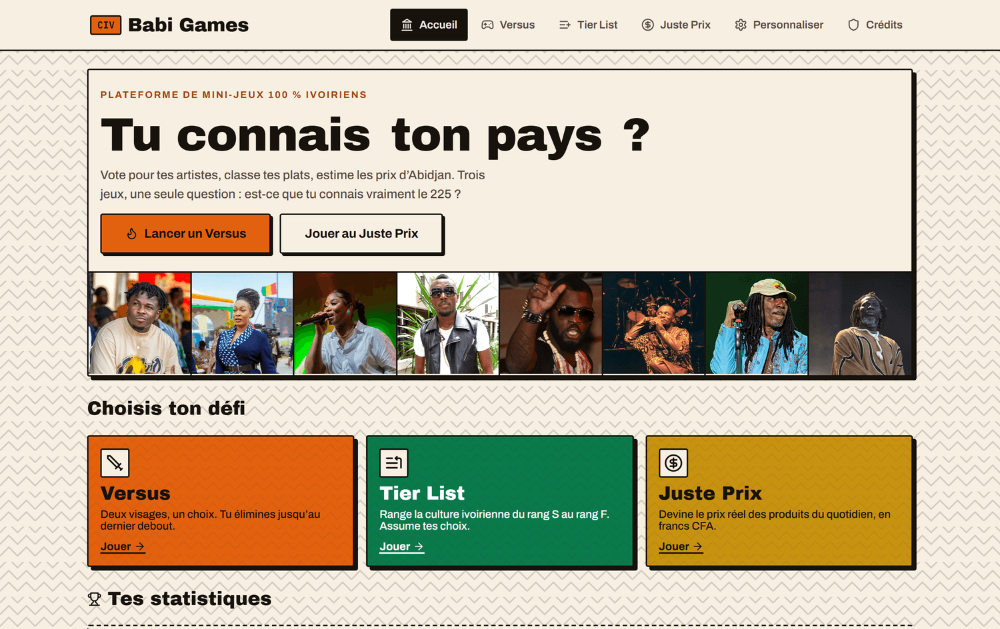
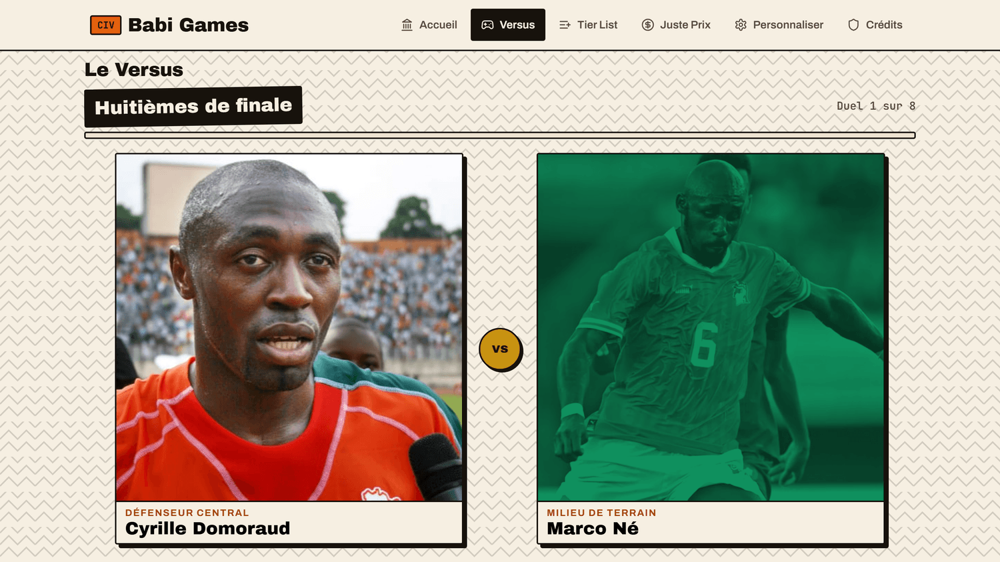
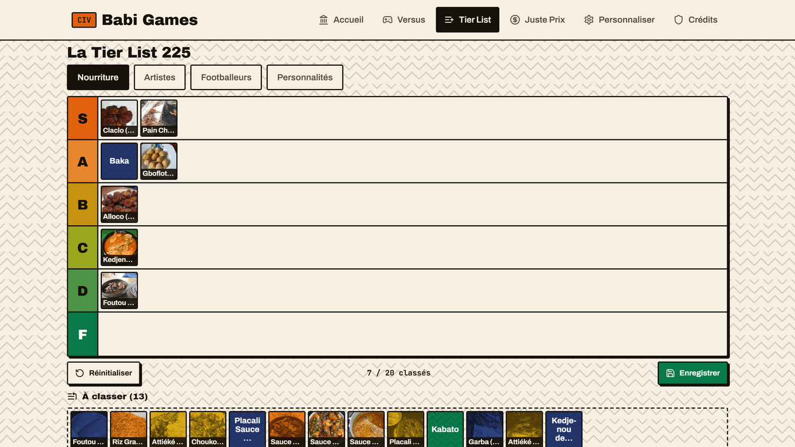

# Babi Games

**Plateforme web de mini-jeux culturels ivoiriens.**
Trois jeux autour des artistes, des footballeurs, des plats et des prix
d'Abidjan, dans une interface inspirée du pagne et de la sérigraphie de rue.

**→ [babi-games.netlify.app](https://babi-games.netlify.app)**

Application 100 % côté client : aucun serveur, aucune base de données,
aucun compte à créer. Installable sur l'écran d'accueil d'un téléphone
comme une application native.

---



<p align="center">
  
  
</p>

---

## Les jeux

### Versus
Tournoi à élimination directe sur 4, 8, 16 ou 32 participants, au choix
parmi les artistes, les footballeurs ou les personnalités publiques
ivoiriennes. Deux visages s'affrontent à chaque duel, le joueur tranche,
et l'arbre se resserre jusqu'au champion. Les tours sont annoncés
— seizièmes, huitièmes, quarts, demi-finale, finale — et la victoire
donne lieu à une célébration animée.

### Tier List 225
Classement par glisser-déposer du rang S au rang F, sur la nourriture,
les artistes, les footballeurs ou les personnalités. Le plateau complet
et la réserve d'éléments tiennent dans un seul écran, sans défilement,
du téléphone au grand écran. Le glisser fonctionne à la souris comme au
doigt, avec une sélection par appui en solution de repli. Les classements
sont conservés sur l'appareil.

### Le Juste Prix
Estimation du prix réel, en francs CFA, de cinq produits du quotidien
ivoirien tirés au hasard. Le score suit un barème continu fondé sur
l'écart relatif, et le résultat final attribue un rang, du « Gaou de
1ʳᵉ classe » au « Djo d'Adjamé ».

---

## Stack technique

| | |
|---|---|
| **Interface** | React 19, React Router 7 |
| **Build** | Vite 8 |
| **Icônes** | lucide-react |
| **Traitement d'images** | sharp (scripts Node hors ligne) |
| **Qualité** | oxlint, Playwright pour les vérifications de rendu |
| **Hébergement** | Netlify, déploiement continu depuis `main` |

**Aucun backend.** Les données du catalogue sont intégrées au build
depuis un fichier JSON, puis mises en cache dans le `localStorage` du
visiteur. Les scores, les classements enregistrés et les ajouts
personnels restent sur l'appareil : rien n'est transmis à un serveur.

Le design system est écrit à la main, sans framework CSS : jetons de
couleur centralisés, échelle typographique de six niveaux, échelle
d'espacement unique. Les contrastes sont vérifiés au niveau WCAG AA,
les zones tactiles respectent le seuil de 44 px, et la navigation au
clavier dispose d'indicateurs de focus visibles.

---

## Application installable (PWA)

Le site s'installe sur l'écran d'accueil et s'ouvre en plein écran,
sans barre d'adresse, sur iOS comme sur Android :

- manifeste complet — mode `standalone`, couleurs de thème, orientation,
  raccourcis vers chaque jeu ;
- icônes en 192 et 512 px, en version standard et *maskable* ;
- balises `apple-touch-icon` et `apple-mobile-web-app-capable`, sans
  lesquelles iOS ignore le manifeste ;
- service worker : navigation en réseau d'abord pour que chaque
  déploiement soit visible immédiatement, images en cache d'abord pour
  rester utilisable sur une connexion faible ;
- zones sûres gérées (encoche, barre d'accueil) via `env(safe-area-inset-*)`.

---

## Installation et lancement en local

Prérequis : **Node.js 20.19+ ou 22.12+** (contrainte de Vite 8) et npm.

```bash
git clone https://github.com/AyyceGoat/jeux-ci.git
cd jeux-ci
npm install
npm run dev
```

L'application est alors servie sur `http://localhost:5173`.

### Scripts disponibles

| Commande | Rôle |
|---|---|
| `npm run dev` | serveur de développement avec rechargement à chaud |
| `npm run build` | build de production dans `dist/` |
| `npm run preview` | sert le build de production en local |
| `npm run lint` | analyse statique (oxlint) |
| `npm run inventaire` | régénère `INVENTAIRE.md` depuis le catalogue |
| `npm run importer-photos` | intègre un lot d'images depuis un dossier local |

---

## Structure du projet

```
src/
  main.jsx              point d'entrée, routeur, service worker
  App.jsx               coquille de l'application, état des collections
  index.css             design system complet (jetons, composants, écrans)
  components/
    Navbar.jsx          navigation, menu mobile
    Dashboard.jsx       accueil, cartes de jeu, statistiques locales
    Versus.jsx          tournoi à élimination directe
    TierList.jsx        plateau S→F, glisser-déposer souris et tactile
    JustePrix.jsx       estimation de prix en francs CFA
    Admin.jsx           ajout de contenu personnel, stocké sur l'appareil
    Credits.jsx         attributions et licences des visuels
    ItemImage.jsx       rendu unifié des visuels
    Toast.jsx           notifications en charte
    ErrorBoundary.jsx   filet de sécurité de rendu
  lib/
    storage.js          accès protégé au localStorage
    random.js           mélange uniforme (Fisher-Yates)
    imageFile.js        redimensionnement des images avant enregistrement
  data/
    db.json             catalogue servi à l'application
    rawItems.json       liste source des éléments

public/
  manifest.json         manifeste PWA
  sw.js                 service worker
  icones/               icônes d'installation
  images/               visuels du catalogue

scripts/
  seed_images.js        collecte automatique de visuels libres
  importer_photos.js    import d'un dossier local d'images
  generer_inventaire.js génération de l'inventaire du catalogue
  lib/                  réseau, résolution, traitement d'images, persistance
```

---

## Déploiement

Chaque `push` sur `main` déclenche un déploiement Netlify. La
configuration vit dans `netlify.toml` : commande de build, dossier
publié, réécriture SPA et en-têtes de cache longue durée sur les
ressources versionnées.
